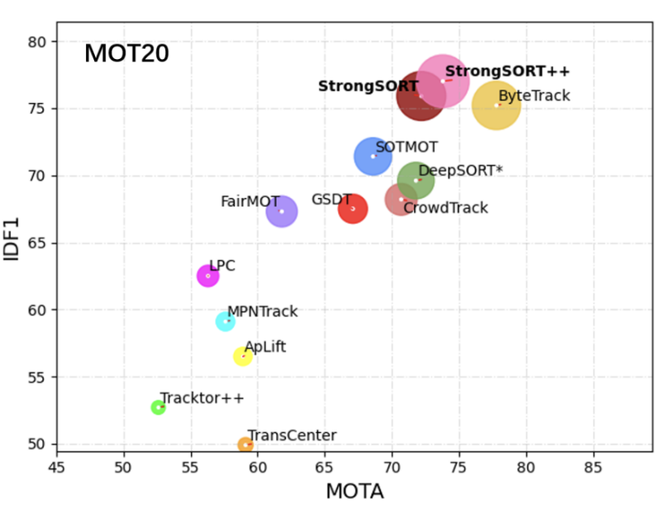

# Vehicle Tracking and Counting with YOLOv8 and ByteTrack

This project demonstrates vehicle tracking and counting using YOLOv8 and ByteTrack. The combined approach offers high accuracy and robustness in real-time vehicle detection, tracking, and counting tasks.

## Table of Contents
- [Vehicle Tracking and Counting with YOLOv8 and ByteTrack](#vehicle-tracking-and-counting-with-yolov8-and-bytetrack)
  - [Table of Contents](#table-of-contents)
  - [Introduction](#introduction)
    - [ByteTrack](#bytetrack)
  - [Features](#features)
  - [Requirements](#requirements)
  - [Installation](#installation)
  - [Usage](#usage)
  - [Demo](#demo)

## Introduction

Vehicle tracking and counting are essential tasks in traffic management, surveillance, and smart city applications. This project leverages the capabilities of YOLOv8 and ByteTrack to achieve real-time and accurate vehicle detection, tracking, and counting.

---

### ByteTrack
<p align = "center">
    
</p>

---

## Features

- Real-time vehicle detection using YOLOv8
- Multi-object tracking with ByteTrack
- Vehicle counting and analysis
- User-friendly interface

## Requirements

- Python 3.x
- PyTorch
- Supervision
- Ultralytics - YOLO

## Installation

Clone the repository and install the required packages:

```bash
git clone https://github.com/VuBacktracking/yolo-bytetrack-vehicle-tracking.git
```

Setup virtual enviroment
```bash
python3 -m venv my_venv
source my_venv/bin/activate
```

Install the requirements
```bash
pip install -r requirements.txt
```

## Usage
Run the main.py
```bash
python3 main.py
```
## Demo
https://github.com/VuBacktracking/yolo-bytetrack-vehicle-tracking/assets/95456622/ab2e3eb4-f673-4cc5-a0a3-ec6955bd0cdd
